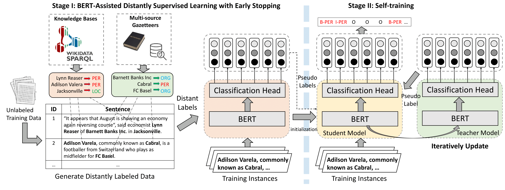

# BOND
This repo contains our code and pre-processed distantly/weakly labeled data for paper [BOND: BERT-Assisted Open-Domain Name Entity Recognition with Distant Supervision (KDD2020)]()

## Summary

## BOND



## Benchmark
The reuslts (F1 score) are summerized as follows:

| Method | CoNLL03 | Tweet | OntoNote5.0 | Webpage | Wikigold |
| ------ | ------- | ----- | ----------- | ------- | -------- |
| Full Supervision | 91.21 | 52.19 | 86.20 | 72.39 | 86.43 |
| Previous SOTA | 76.00 | 26.10 | 67.69 | 51.39 | 47.54 |
| BOND | 81.48 | 48.01 | 68.35 | 65.74 | 60.07 |

- *Full Supervision*: Roberta Finetuning/BiLSTM CRF
- *Previous SOTA*: BiLSTM-CRF/AutoNER/LR-CRF/KALM/CONNET


## Data

We release five open-domain distantly/weakly labeled NER datasets here: [DataSet](datset)


## Citation

Please cite the following paper if you are using our datasets/tool. Thanks!

- Chen Liang*, Yue Yu*, Haoming Jiang*, Siawpeng Er, Ruijia Wang, Tuo Zhao and Chao Zhang, "**[BOND: Bert-Assisted Open-Domain Named Entity Recognition with Distant Supervision]()**", in Proc. of the 26th ACM SIGKDD International Conference on Knowledge Discovery and Data Mining (KDD'20)

```
@inproceedings{chen2020bond,
  title = {BOND: Bert-Assisted Open-Domain Named Entity Recognition with Distant Supervision}, 
  author = {Liang, Chen and Yu, Yue and Jiang, Haoming and Er, Siawpeng and Wang, Ruijia and Zhao, Tuo and Zhang, Chao}, 
  booktitle = {Proceedings of the 26th ACM SIGKDD International Conference on Knowledge Discovery and Data Mining}, 
  year = 2020, 
}
```